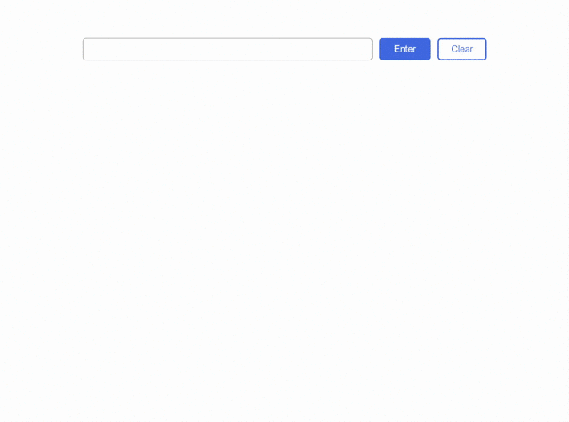

# 丘멥imple Typeahead Search - Books edition

## 🟢 About

Coding this small typeahead search bar tool was an amusing moment! I had a great time working on this React Frontend project and implementing the functionality that provides real-time search suggestions. Overall, it was a fun project that allowed me to explore my coding skills and create something practical; It can be adapted to any database and integrated into a backend system with ease.

## 🟢 Features

- Real-time Suggestions: The tool provides immediate suggestions as the user types.
- Search Term Prediction: The tool predicts the user's intended search term based on their input and offers relevant suggestions accordingly.
- Search Term Highlighting: It highlights the matching portion of the suggested options, making it easier for users to identify the relevant terms.
- Keyboard accessibility/navigation makes it easy to anyone who wants to navigate.
- Responsive Design: The tool is designed to work seamlessly on different devices and screen sizes.

## 🟢 Demo

## 🟢 Functionality

> __Arrow up & down__ : _Navigate in the suggestions menu_

> __Spacebar__ : _Close the suggestions menu_

>__Enter__ : _Enter_

>__Tab__ : _Next tab stop_

## 🟢 Project Setup
1. Open a terminal in VS Code
2. Type `yarn install`
3. Use `yarn start` to run the environment